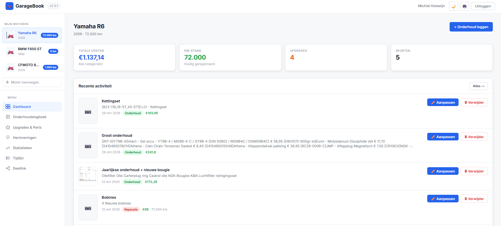
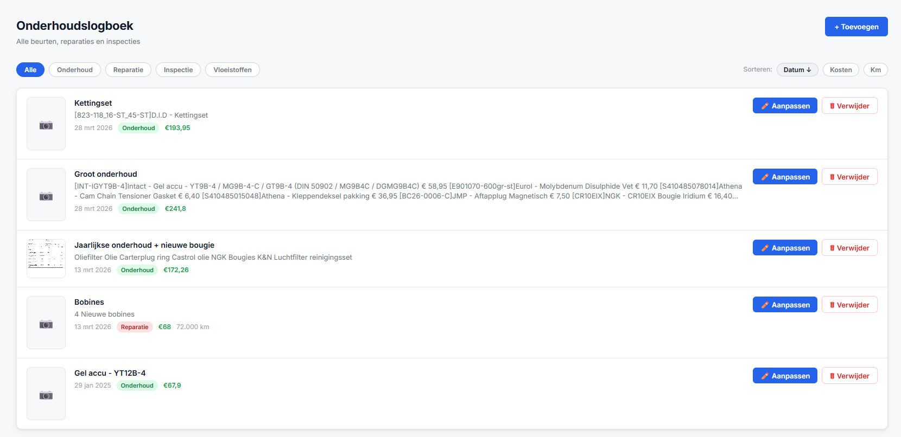
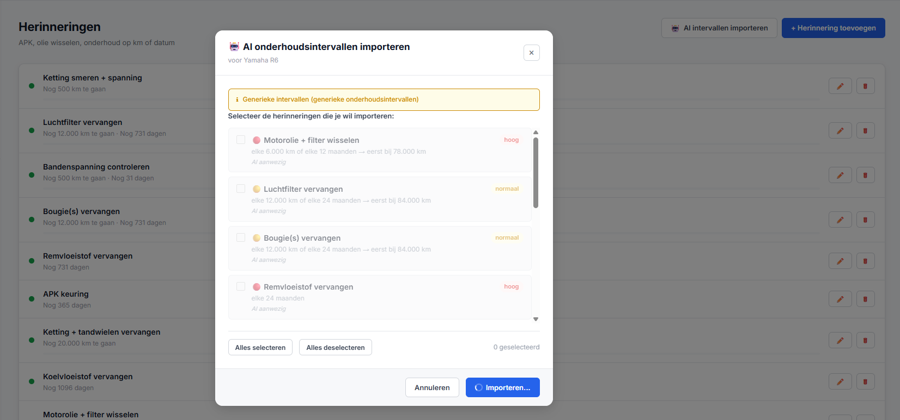

# 🏍️ GarageBook

> **Self-hosted vehicle maintenance and upgrade logbook** — runs on Proxmox LXC, accessible via your own domain.

GarageBook helps you capture the complete history of your vehicle: maintenance sessions, upgrades, costs, photos and reminders — all in one place, for multiple users and multiple vehicles.

## 📸 Screenshots







---

## ✨ Features

| Feature | Description |
|---|---|
| 👤 **User accounts** | Register with email + password, JWT sessions (7 days) |
| 🚗 **Multi-vehicle** | Unlimited vehicles per account — motorcycle, car or camper |
| 📋 **Maintenance log** | Track services, repairs, inspections and fluid changes |
| ⭐ **Upgrades & Parts** | Log modifications and parts with brand, category and cost |
| 📷 **Photos** | Upload a photo per log entry or upgrade (max 8MB) |
| 🔔 **Reminders** | By mileage, date or both — with progress bar and repeat |
| 🤖 **AI intervals** | Automatically look up official service intervals via AI + web search |
| 📊 **Statistics** | Costs per year, per category, per km and per month |
| 🔗 **Share link** | Share your logbook read-only with others, no account needed |
| 📄 **PDF export** | Print the full logbook via the browser |
| 🌙 **Dark mode** | Follows system preference, manually toggleable |
| 📱 **PWA** | Installable as an app on iPhone and Android |
| ↕️ **Sorting** | Sort log and upgrades by date, cost or mileage |
| 🌍 **5 languages** | Dutch, English, German, French and Spanish |
| 🔑 **Password reset** | Via email — configurable through the admin portal |
| 🏛️ **Admin portal** | Manage users, backups, API keys and SMTP at `/admin` |
| 🔢 **Version badge** | Always visible in the topbar — useful after updates |

---

## 🛠️ Tech stack

| Layer | Tech |
|---|---|
| Frontend | Vanilla HTML/CSS/JS (single file, no build step) |
| Backend | Node.js + Express |
| Database | SQLite via better-sqlite3 |
| Auth | JWT + bcrypt |
| Photos | Multer — stored on disk |
| AI | Anthropic Claude Haiku + web search |
| Email | Nodemailer (SMTP) |
| Hosting | Proxmox LXC — Ubuntu 22.04 |
| Proxy | Nginx Proxy Manager |
| HTTPS | Let's Encrypt via Cloudflare |

---

## 🚀 Installation on Proxmox

### Requirements
- Proxmox VE 7 or 8, root access
- Internet connection from within the container

```bash
# Clone the repository on the Proxmox host
apt-get install -y git
git clone https://github.com/Holewijn/garagebook.git /root/garagebook-repo
cd /root/garagebook-repo
chmod +x install-garagebook.sh update-from-github.sh
bash install-garagebook.sh
```

The script interactively asks for container ID, network, storage, domain and HTTPS settings.

---

## 🔄 Deploying updates

```bash
# From inside container 118 (after one-time setup)
garagebook-update
```

Or manually from the Proxmox host:
```bash
GITHUB_REPO=Holewijn/garagebook bash /root/garagebook-repo/update-from-github.sh 118
```

---

## 🤖 Setting up AI service intervals

The AI feature uses Claude Haiku with web search to look up official maintenance intervals for any vehicle.

**Step 1** — Create an API key at [console.anthropic.com](https://console.anthropic.com)
- Free $5 credit on registration
- Claude Haiku costs ~$0.001 per query (cents per month)

**Step 2** — Set the key inside the container:
```bash
pct enter 118
echo 'ANTHROPIC_API_KEY=sk-ant-...' >> /etc/garagebook.env
systemctl restart garagebook
```

**Step 3** — Usage:
- **New vehicle**: click "Next — AI reminders →" in step 2 of the add vehicle flow
- **Existing vehicle**: Reminders tab → "🤖 Import AI intervals"

> Without an API key the button still works — generic intervals are used as a fallback.

---

## 📧 Setting up email (password reset)

Configure SMTP through the admin portal at `/admin` → Settings → SMTP configuration.

**Gmail example:**
```
Host:     smtp.gmail.com
Port:     587
User:     your@gmail.com
Password: [App password from myaccount.google.com/apppasswords]
App URL:  https://garagebook.yourdomain.com
```

---

## 🏛️ Admin portal

Accessible at `/admin` with a separate password (`ADMIN_PASSWORD` in `.env`).

**Set admin password for existing installations:**
```bash
pct exec 118 -- bash -c "
  echo 'ADMIN_PASSWORD=choose-a-strong-password' >> /etc/garagebook.env
  systemctl restart garagebook
"
```

**Sections:**
- **Dashboard** — user/vehicle/item counts, storage usage, system status, registration chart
- **Users** — view all accounts, edit name/email/password, delete, inspect all vehicles
- **Backups** — list, download, create and delete backups
- **Settings** — Anthropic API key, SMTP configuration, open password reset requests

---

## 🔧 Management

```bash
pct enter 118                                     # Shell into container
pct exec 118 -- systemctl status garagebook       # Service status
pct exec 118 -- journalctl -u garagebook -f       # Live logs
pct exec 118 -- systemctl restart garagebook      # Restart
pct exec 118 -- garagebook-backup                 # Manual backup
pct exec 118 -- ls -lh /var/backups/garagebook/   # List backups
pct exec 118 -- cat /etc/garagebook.env           # View settings
```

### Paths inside the container

| Path | Contents |
|---|---|
| `/opt/garagebook/` | Application files |
| `/var/lib/garagebook/garagebook.db` | SQLite database |
| `/var/lib/garagebook/uploads/` | Uploaded photos |
| `/etc/garagebook.env` | JWT secret, port, API keys, SMTP |
| `/var/backups/garagebook/` | Daily backups (14 days retained) |

---

## 🗺️ API reference

<details>
<summary>Expand all endpoints</summary>

| Method | Route | Auth | Description |
|---|---|---|---|
| POST | `/api/auth/register` | — | Create account |
| POST | `/api/auth/login` | — | Log in |
| GET | `/api/auth/me` | ✓ | Current user |
| POST | `/api/auth/forgot-password` | — | Request password reset |
| POST | `/api/auth/reset-password` | — | Set new password |
| GET | `/api/bikes` | ✓ | All vehicles |
| POST | `/api/bikes` | ✓ | Add vehicle |
| PUT | `/api/bikes/:id` | ✓ | Update vehicle |
| DELETE | `/api/bikes/:id` | ✓ | Delete vehicle |
| POST | `/api/bikes/:id/share` | ✓ | Create share link |
| DELETE | `/api/bikes/:id/share` | ✓ | Remove share link |
| GET | `/api/share/:token` | — | Public read-only data |
| GET | `/api/bikes/:id/logboek` | ✓ | Get maintenance log |
| POST | `/api/bikes/:id/logboek` | ✓ | Add log entry |
| PUT | `/api/bikes/:id/logboek/:id` | ✓ | Update log entry |
| DELETE | `/api/bikes/:id/logboek/:id` | ✓ | Delete log entry |
| GET | `/api/bikes/:id/upgrades` | ✓ | Get upgrades |
| POST | `/api/bikes/:id/upgrades` | ✓ | Add upgrade |
| PUT | `/api/bikes/:id/upgrades/:id` | ✓ | Update upgrade |
| DELETE | `/api/bikes/:id/upgrades/:id` | ✓ | Delete upgrade |
| GET | `/api/bikes/:id/herinneringen` | ✓ | Get reminders |
| POST | `/api/bikes/:id/herinneringen` | ✓ | Add reminder |
| PUT | `/api/bikes/:id/herinneringen/:id` | ✓ | Update reminder |
| DELETE | `/api/bikes/:id/herinneringen/:id` | ✓ | Delete reminder |
| POST | `/api/ai/onderhoudsintervallen` | ✓ | Look up AI intervals |
| POST | `/api/upload` | ✓ | Upload photo |
| GET | `/api/version` | — | Version number |

</details>

---

## 💡 Ideas for future features

### Practical & useful
- **⛽ Fuel tracking** — log fill-ups with litres, price and consumption per 100 km
- **🔎 Search** — search through the log and upgrades by keyword
- **📅 Calendar view** — maintenance and reminders on a calendar
- **🏷️ Tags / labels** — add custom labels to entries for better filtering
- **📎 Document attachments** — attach PDFs (invoices, warranty certificates, MOT reports)

### Multi-user
- **👥 Shared write access** — give a mechanic or co-rider access to a vehicle
- **🏢 Garage management** — manage multiple customers and vehicles for a workshop

### Integrations
- **📧 Email reminders** — receive an email when a service interval is approaching
- **📲 Push notifications** — via PWA or Telegram bot
- **🗺️ Trip logging** — record routes and distances via GPS
- **🔌 OBD2 integration** — automatically read mileage via Bluetooth OBD2 dongle
- **📦 Parts inventory** — track stock of spare parts

### Value tracking
- **💰 Purchase value vs. investments** — what the vehicle cost and what you've put into it
- **📈 Value report** — exportable overview for sale or insurance purposes
- **🏆 Mileage history** — graph of odometer readings over time

---

## 📁 Project structure

```
garagebook/
├── backend/
│   ├── server.js           # Express API — all endpoints
│   └── package.json
├── frontend/
│   ├── index.html          # Full SPA — HTML + CSS + JS
│   ├── admin.html          # Admin portal
│   ├── logo.svg            # GarageBook logo
│   ├── bg-login.svg        # Login page background
│   └── manifest.json       # PWA config
├── docs/
│   ├── afbeelding1.png     # Screenshot 1
│   ├── afbeelding2.png     # Screenshot 2
│   └── afbeelding3.png     # Screenshot 3
├── .github/
│   └── workflows/
│       └── deploy.yml      # Auto-deploy on git push
├── install-garagebook.sh   # First-time installation on Proxmox
├── update-from-github.sh   # Update from GitHub (run on Proxmox host)
├── update-garagebook.sh    # Update from inside container
├── .gitignore
└── README.md
```

---

## 📋 Changelog

| Version | What's new |
|---|---|
| **v2.6.0** | Professional logo, cinematic login page, 5 languages, password reset via email, SMTP config in admin |
| **v2.5.1** | Mileage always read from database — no browser cache |
| **v2.5.0** | Multi-vehicle support: motorcycle, car and camper with type-specific categories and AI |
| **v2.4.0** | Admin portal at `/admin` — users, backups, stats, API key and SMTP management |
| **v2.3.1** | Import AI intervals for existing vehicles |
| **v2.3.0** | AI service intervals on vehicle creation (Claude Haiku + web search) |
| **v2.2.0** | Reminders, statistics, share link, PDF export, dark mode, PWA, sorting |
| **v2.1.0** | Version badge in topbar and page title |
| **v2.0.0** | Photo upload, edit button, notes field, card design |
| **v1.0.0** | Initial release — auth, multi-vehicle, log, upgrades, cost analysis |

---

*Built with ❤️ for drivers who want to stay on top of their machine.*
